# Machine Learning Engineer Nanodegree
## Capstone Project
Yves Fauser,
September 13th, 2019

## I. Definition

### Project Overview

Overhead power lines are susceptible to various outside influences like tree branches falling onto the line, mechanical damage through material fatigue, etc. 

Failing power lines can lead to power outages, cutting of whole rural villages and cities from electricity supply, or even worse, line faults can cause fires through heat caused by power resistance and discharges.

The problem, and how it can be solved with the help of machine learning, is detailed in an academic paper written by the technical University of Ostrava (Czech Republic) [[1]](https://www.dropbox.com/s/2ltuvpw1b1ms2uu/A%20Complex%20Classification%20Approach%20of%20Partial%20Discharges%20from%20Covered%20Conductors%20in%20Real%20Environment%20%28preprint%29.pdf?dl=0).

At the core of the possible solution using machine learning is the detection of particular pulses found when measuring energy radiation using coils clamped onto the overhead power lines. Tis energy radiation is measured in short samples, and made available for central analysis using the cellular network. Depending on the patterns seen in the data, conclusions can be drawn on whether the overhead line needs to be inspected by a field technician team.

### Problem Statement

Partial damage of overhead power lines by external factors is hard to diagnose. Even with large scale regular inspection of power lines e.g. through manual visual inspection, or fly overs with drones, a lot of material fatigue and partial damage problems can stay undiscovered.
Therefore a solution is needed that relies solely on analysis of sensor data (coils clamped onto the overhead power lines), discovering specific patterns in samples measured at the overhead power line. A key early indicator of a condition of the overhead power line that needs attention is partial discharge (PD). PD is generating specific patterns that can be seen in the sensor data, and gives a good indication e.g. of tree branch contact.

[[2]](https://en.wikipedia.org/wiki/Partial_discharge) `Whenever partial discharge is initiated, high frequency transient current pulses will appear and persist for nanoseconds to a microsecond, then disappear and reappear repeatedly as the voltage sinewave goes through the zero crossing`

The problem of discovering damages on overhead power lines can therefore be solved by analyzing the sensor data, finding PD patterns and distinguish them from other patterns e.g. caused by corona discharge and other commonly found external influences to the power line.

### Metrics

The goal of this project is to detect PD patterns and send out field teams to find and repair defects in overhead lines before an complete outage occurs.
The costs associated with a False Negative is very high, as a defective power line might not be detected, and might fail causing a widespread outage that may even be life threatening.
There is also a cost associated with False Positives, as there is a high effort of erroneously sending out a field team to inspect an overhead line that turns out not to be faulty.

Recall is the most important metric in this project, as it calculates how many of the Actual Positives the model captures through labeling it as Positive (True Positive)  

  

Where TP is the number of true positives, TN the number of true negatives, FP the number of false positives, and FN the number of false negatives.

So, Recall is a good indicator for how many time the model missed classifying a faulty overhead power line as faulty, therefore risking and highly impact outage.

Another metric to use is Precision. Precision calculates how many of the samples predicted by the model as positive are actually really positive:

  

So, Precision is an indicator of how many times the model misclassified the line as faulty, and a field technician team was sent out erroneously causing unnecessary costs and efforts.

In addition I will calculate 3 additional metrics: Accuracy, F1-Score and MCC. 

Accuracy will tell how the ratio of correctly classified samples out of the total number of samples. Accuracy is actually not a good metric to look at with the Dataset I use in this project. I will go into details of this dataset in the later chapters, but what can be said here is that the dataset is highly imbalanced with only 6.41% of the samples in the available training dataset being positives (525 positive and 8187 negative training samples). Therefore the number of true negatives will be very high generating a high accuracy score. I will however include it for completeness.

F1-Score is a better metric for this project, as it balances Precision and Recall, which are the two metrics giving us a good indication on the costs associated with our models false predictions:

  

F1 score is the harmonic mean of precision and recall.

And finally I calculate the Matthews correlation coefficient (MCC) between the predicted and actual truth in the dataset. The MCC is given by:

The Dataset is taken from a Kaggle competition [[3]](https://www.kaggle.com/c/vsb-power-line-fault-detection/data) that uses MCC as evaluation metric. The MCC is in essence a correlation coefficient between the observed and predicted binary classifications; it returns a value between −1 and +1. A coefficient of +1 represents a perfect prediction, 0 no better than random prediction and −1 indicates total disagreement between prediction and observation.
While MCC serves a purpose very similar to F1-Score, it is able to show cases of reversed classifications by turning negative.

The Kaggle competitions Test Dataset does not have public available truth labels, therefore the final evaluation of the Test dataset will only give us an MCC. For the Training Dataset, where truth labels are available, I will carve out a validation set and evaluate Accuracy, Recall, Precision and F1-Score too. 

## II. Analysis

### Data Exploration & Visualization

As part of a Kaggle competition, the Technical University of Ostrava (Czech Republic) provided sensory data of medium voltage power lines [[3]](https://www.kaggle.com/c/vsb-power-line-fault-detection/data). The data was obtained from a low cost sensor (metering) device developed at the University and mounted at 20 different location within a region in the Czech Republic. The data was gathered from a real life power distribution network, and is therefore noisy because of real world disturbances caused by the power lines acting as antennas for electromagnetic signals generated in proximity of the power lines like radio stations, nearby lightning strikes and corona discharges.

The dataset is divided into one training and one test dataset available in the Apache Parquet format. Other than is most datasets each column instead of each row is containing one sample. Each sample (each column) has 800,000 measurements taken during a 20 millisecond time windows which equates to one complete grid cycle of the 3 phases measured. 

Here is an example of what the first 5 rows of the training data look like:

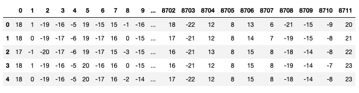

Each column of the training and test data file represents a **signal_id** which is a key in a separate csv file provided with the data that has the following additional metadata:

- **id_measurement:** the ID code for a trio (3-phases) of signals recorded at the same time.
- **signal_id:** A foreign key for the signal data (sample). Each signal ID is unique across both train and test, so the first ID in train is '0' but the first ID in test is '8712'.
- **phase:** the phase ID code within the signal trio. The phases may or may not all be impacted by a fault on the line.
- **target:** 0 if the power line is undamaged, 1 if there is a fault.

Here's an example of what the first 10 rows of the training metadata looks like:

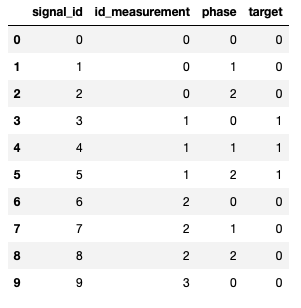

The targets where manually classified by a domain expert that looked at noise patterns present in the data. If the sample is showing a PD pattern, the target is set to 1, if any other or no disturbance pattern is preset the target is set to 0. Each of the 3 phases is treated independently, so a PD pattern might be present on one of the phases, but might not be present in another. Only the training metadata is labeled with targets. The test dataset is part of the Kaggle competition and the targets are therefore hidden from public. 

The data is imbalanced, as it contains only 525 true positives in 8711 samples.

When looking at the data in a graphical way, a simple plot of the signal amplitude (the values of the measurements) in relation to time gives us good insights.

**signal_id 201:** Example of a sample that is labeled as having a PD pattern present:

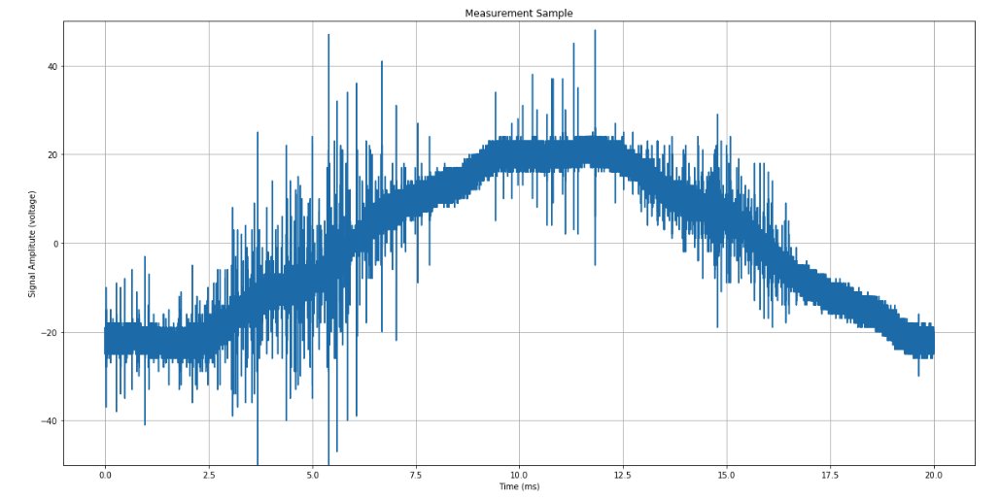

**signal_id 333:** Example of a sample that is not showing a PD pattern:

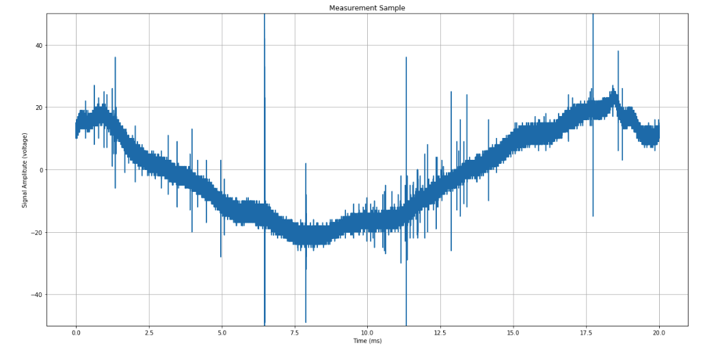

Looking at these two plots we can make a couple of observations:

1) The measurement devices are not synchronized with the power grids 50Hz phase. As you can see in the two examples, while the sample covers one sine wave, the start and end of each measurement is not synchronized with a specific state of the 50Hz sine wave. This is an important observation as the PD pattern is expected to happen as the voltage sinewave goes through the zero crossing. Therefore to make the samples comparable I had to shift the samples so that they all start / end at the zero crossing.
2) In the first example the PD pattern is well distinctive and high frequency pulses are visible before and after the zero crossing.
3) The second example shows very well what corona discharges look like. The corona discharges are visible as high amplitude high frequency pulses.
4) Both examples show the always present low amplitude noise e.g. caused by radio stations and the likes

Not all samples are as easy to interpret as the two I choose to present here. In general it is very difficult for non-experts to distinguish PD from corona discharges and other noise.

Another visualization technique I extensively made use of is to look at the data using a spectogram. Here is the spectogram of the first example (signal_id 333) that has a PD pattern present:

**signal_id 201:** Spectogram
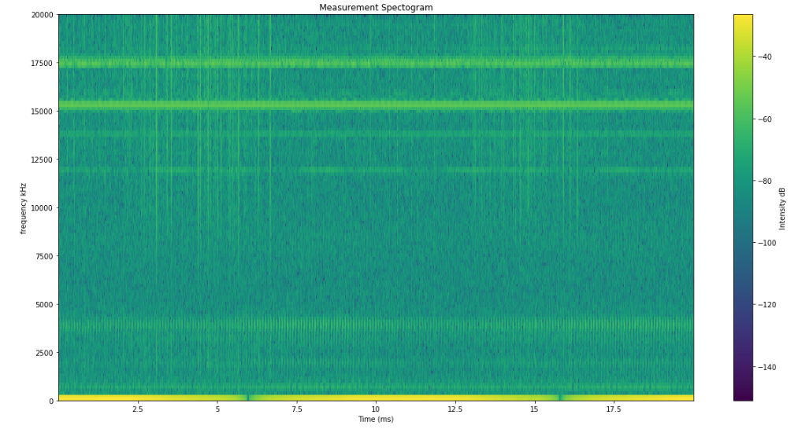

I am using matplolib's specgram function [[4]](https://matplotlib.org/3.1.1/api/_as_gen/matplotlib.pyplot.specgram.html) to generate the above spectogram.
This function uses Fast Fourier transform [[5]](https://en.wikipedia.org/wiki/Fast_Fourier_transform) with Nx sliding windows to compute the spectogram. In a nutshell it shows the intensity (amplitude) of specific frequencies in the spectrum over time, whereas the line plot only shows the amplitude and not the frequencies contained in the sample.

### Algorithms and Techniques

As you will read in the Benchmark section of this document, the existing work of the University of Ostrava tested the use of the random forest algorithm to detect PD patterns in the samples. In my project I wanted to see if I can achieve similar or better results using various neural networks.

Most of the work in this project went into preprocessing the data so that it can be feed into a neural network to predict whether a PD pattern is present in the sample or not. Here's a general overview:

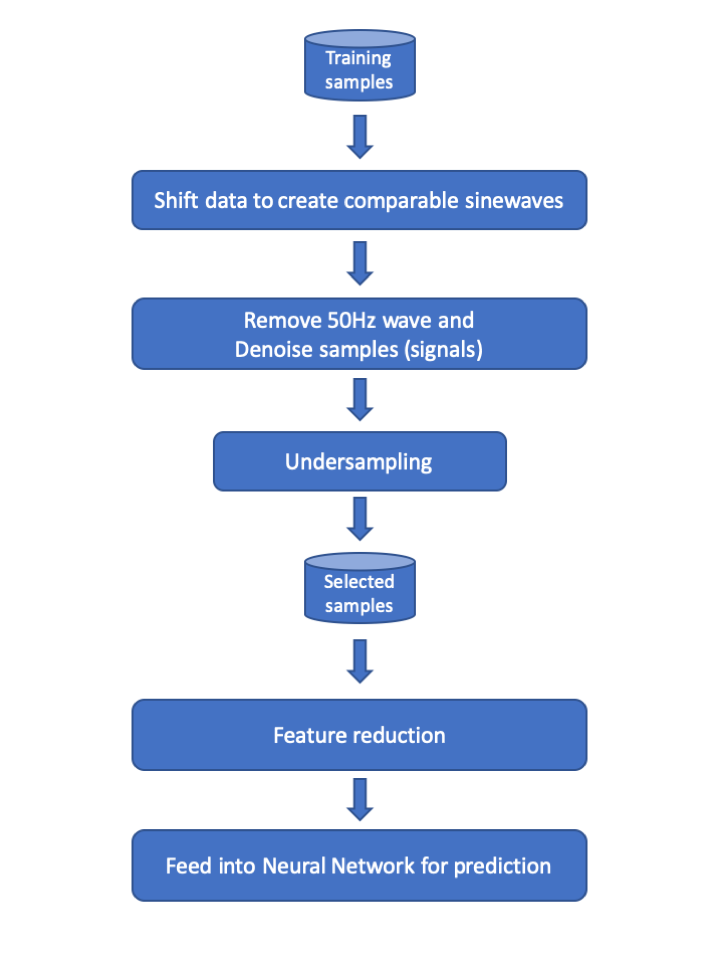

**Step 1)** As briefly mentioned in the last section, to make the samples comparable in the time domain, the sample data needs to be shifted so that the start and end of the sample is at the zero crossing of the 50Hz sinewave. I will go into more details of how this was done in the 'Data Preprocessing' section of this document

**Step 2)** Fault pattern usually exists in high frequency band. According to literature, the pattern is visible above 10^4 Hz, therefore I used a Butterworth filter [[6]](https://en.wikipedia.org/wiki/Butterworth_filter) to remove all frequencies bellow 10^4 Hz. This removes the 50Hz sinewave and other low frequency signals. Then the signal is cleaned from low amplitude noise like radio transmissions with the use of wavelet decomposition and thresholding [[7]](http://connor-johnson.com/2016/01/24/using-pywavelets-to-remove-high-frequency-noise/)

**Step 3)** As the training dataset is imbalanced I used undersampling. I selected all samples labeled as positives, and a subset of random samples from 4 bins categorized by the number of amplitude peaks found in the samples.

**Step 4)** I used two different data reduction techniques and compared the results using a Convolutional Neural Network (CNN). The first technique used is principle component analysis (PCA). I then directly feed the resulting 325 PCA features into a one dimensional CNN as input. The other technique I used was to generate 224x224x3 (RGB) spectograms using matplotib, store them as .png images and feed those into a two dimensional CNN as input

**Step 5)** The reduced data is feed into 4 different types of neural networks. I explored the combination of PCA with a Dense Neural Network, PCA with a 1D CNN, Spectogram pictures with a 2D CNN and Spectogram pictures with a 2D CNN using transfer learning from the VGG16 neural network.

### Benchmark

The key benchmark in this project are the results documented in the early paper of the technical University of Ostrava [[1]](https://www.dropbox.com/s/2ltuvpw1b1ms2uu/A%20Complex%20Classification%20Approach%20of%20Partial%20Discharges%20from%20Covered%20Conductors%20in%20Real%20Environment%20%28preprint%29.pdf?dl=0).

Using an implementation of the random forest algorithm and various tuning documented in the paper they where able to achieve the following results:

| Metric     | Result  |
|------------|---------|
| Accuracy   | 99.8    |
| Precision  | 83.6    |
| Recall     | 66.7    |
| F1-Score   | 72.8    |

*See Table 4) on Page 6, Column 'SOMA' / 'RA SP HA', 'entire dataset (blue)'*

My aim was to achieve similar or better results with a neural network implementation.

In addition to the above results of the paper of the technical University of Ostrava, my aim was to achieve results that would put me approximately in the middle of the leaderboard of the Kaggle competition [[8]](https://www.kaggle.com/c/vsb-power-line-fault-detection/leaderboard). At the time of writing the top score of the winning team is a very high **MCC of 0.71899**

## III. Methodology

### Data Preprocessing

The data preprocessing was key in this project, and a lot of effort went into it. The following graphic shows the visual representation of all pre-processing steps:

**signal_id 201:** Data pre-processing steps
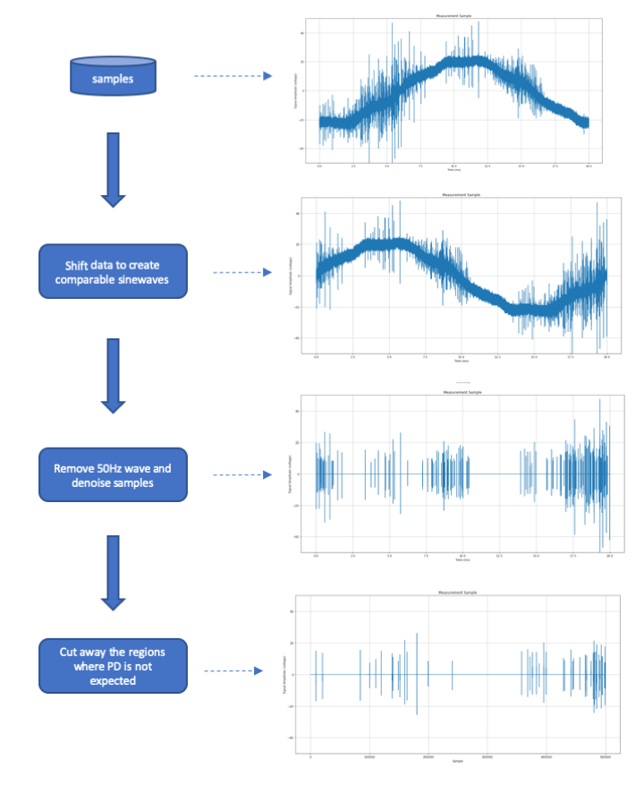

**Step 1)** As all samples need to get comparable in the time domain, I decided to apply a simple 'trick'. I am searching for the datapoint in the sample that is the closest to the first zero crossing of the 50Hz 'base' sinewave. I then shift all the datapoints before that datapoint to the right, essentially generating a clean sinewave that starts with zero and ends with zero and has a zero crossing in the middle. As PD patterns are present on specific locations during the sinewave this shift might not represent to time domain 'reality', but as the patterns always repeat in the time domain at the same position it doesn't matter if the true measurement was shifted in this way

**Step 2)** Using a Butterworth filter [[6]](https://en.wikipedia.org/wiki/Butterworth_filter) I remove all frequencies bellow 10^4 Hz. Then using wavelet decomposition and thresholding [[7]](http://connor-johnson.com/2016/01/24/using-pywavelets-to-remove-high-frequency-noise/) I filter out low amplitude noise from the sample.

**Step 3)** The datapoints (0, 50000), (300000, 450000), (700000, 800000) are cut away from the sample, reducing each sample to 500.000 data points. This is done as the occurrence of the PD patterns is not expected at these locations.

PD patterns are only seen at specific locations on the 50Hz base sinewave.

[[9]](http://www.hitequest.com/Kiss/hv_isolation.htm)
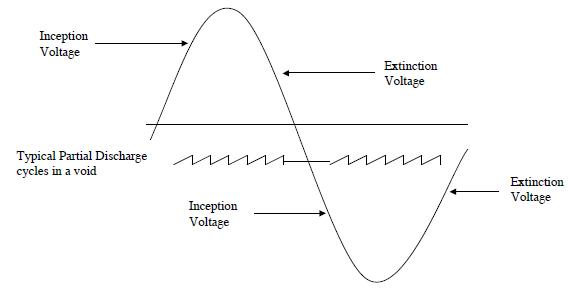

I applied Steps 1), 2) and 3) on all 8712 training samples as well as all 20.336 test samples as a batch job, creating new parquet files.

The next steps for the training data was to do undersampling, as the dataset is imbalanced with 525 positive and 8187 negative training samples.
To be able to select relevant training samples from the training data I decided to count the amount of amplitude peaks in each of the pre-processed samples and categorized them in 4 different bins:

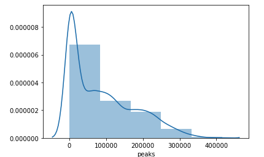

I then selected all 525 PD positive samples and added 525 random samples from each of the 4 bins resulting in a dataset with 2625 samples.

As the next step I reduced the features from the 500.000 measurements per sample down to something I cold use as an input to a neural network. I tested two very different approaches whose results I will discuss in the later parts of this document. The first approach was to use Principal Component Analysis (PCA), the second was to generate small 244x224x3 (RGB) sized spectogram pictures from the samples.

For the PCA approach I first searched for the minimum number of components to use. Using the `explained_variance_ratio_` method I looked for the number of features where the percentage of variance explained did not improve anymore:

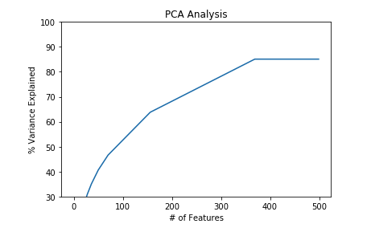

The number of components I used turned out to be 369. I finally transformed the 2625 selected samples and stored the resulting 2625x369 dataset to feed it into a neural network later.

For the second approach I used the `specgram` method of matplotlib to generate 244x224x3 spectogram pictures and store them on disk in separate 'pd_positive' and 'pd_negative' folders. Here are a couple of examples:

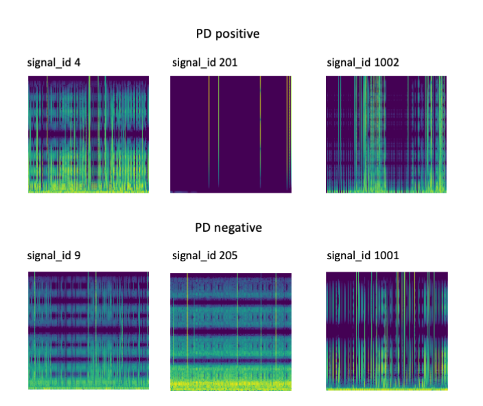

As you will likely see it is very difficult for the human eye to spot the key differences between samples with detected PD patterns and samples that are negative. As I will show in the results section it is astonishing that the 2D neural networks (CNNs) are still able to recognize the patterns relatively well.

The test data (20.336 test samples) was directly converted to the spectogram pictures only after the pre-processing steps. As you will see later in the document the PCA results where not encouraging, therefore creating a test PCA dataset wasn't needed.

### Implementation

As I already described earlier, I tested 4 different combinations of feature reduction and neural networks:

| Input Data           | Neural Network Type                |
|:---------------------|:-----------------------------------|
| PCA                  | Dense network                      |
| PCA                  | 1D CNN                             |
| Spectogram pictures  | 2D CNN                             |
| Spectogram pictures  | 2D CNN - Transfer learning  VGG16  |

In all cases the training input data was split into a training and validation dataset, with the validation dataset being 20% of the total available training data. I did not carve out a test dataset from the training data, as a large test dataset was available from Kaggle, and I did not want to loose another 20% of the training data. This however comes with the drawback that only the MCC score is available as a result of the test run and evaluation of the test dataset is only available trough the Kaggle web site.

I initially started the training of the Dense Network and 1D CNN on my Laptop without GPUs. Later when training the 2D CNNs this was not possible anymore, therefore I switched to using Google colab [[10]](https://colab.research.google.com) and ran the Training and Evaluation Notebooks there using GPUs.

#### PCA + Dense Network implementation

The following graphic is directly exported from Keras and shows the layers and number of nodes I choose for the Dense Network. The first layer takes the 1-dimensional input of the 369 PCA components as Input but reshaped to (369, 1).

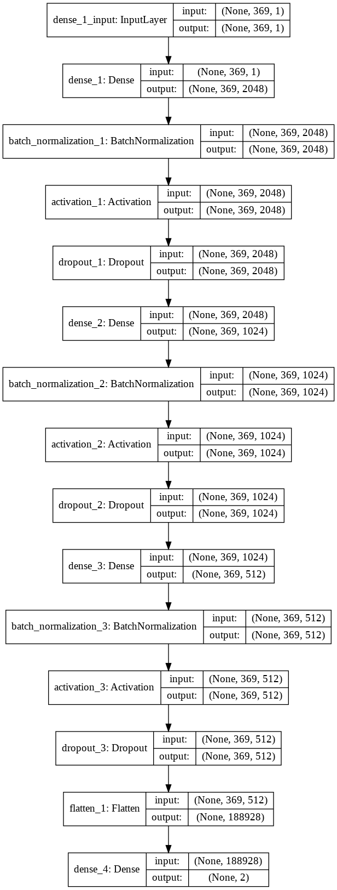

As you can see I use Batch Normalization before and a Dropout of 0.35 after the Relu activation in each layer. The final layer has an output of 2, so the output is indicating the probability of two categories, the 'PD is present' and 'PD is absent' category. Before evaluating the performance using Accuracy, Precision, Recall, F1-Score and MCC functions I convert the probabilities into binary values, taking the highest probability as 1 and the lowest as 0.  

#### PCA + 1D CNN implementation

The 1-D CCN implementation is similar to the Dense Network on the Input side. The first layer takes the 1-dimensional input of the 369 PCA components as Input but reshaped to (369, 1).

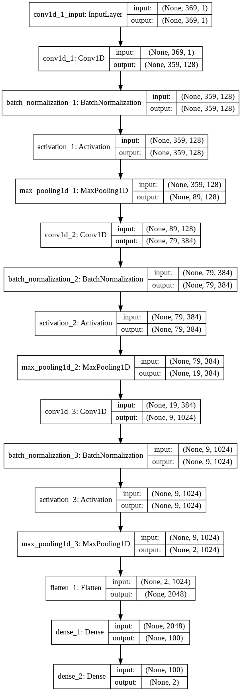

I am stacking 1D convolutional layers (Conv1D) with Batch Normalization, Relu activation and MaxPooling1D layers. In the final layer I flatten the output of the last MaxPooling1D layer and run it through two final Dense layers. Again the output is consisting two categories, 'PD is present' and 'PD is absent'

#### Spectogram pictures + 2D CNN implementation

The input layer of the spectograms + 2D CNN implementation is obviously very different from the PCA input layer as it is now a 224x224x3 RGB picture. Each picture is converted to a 4D tensor with the shape (1, 224, 224, 3), and then rescaled so that every pixels RGB color information is converted from an integer ranging from 0 to 255 to a floating point number between 0.0 and 1.0.
These rescaled tensors are now used as the input to the first layer.

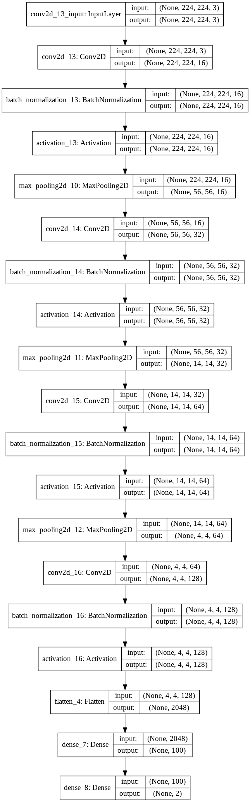

The stacking of layers I choose is very similar to the 1D + PCA implementation but with the 2D equivalents (Conv2D). The final Dense layers again lead to a 2 categorical output representing 'PD is present' and 'PD is absent'.

#### Spectogram pictures + 2D CNN Transfer learning VGG16 implementation

The Transfer Learning implementation is using the exact same input layer and reshaping as the non-transfer learning implementation. As final base model I used VGG16 with pre-loaded weights trained on imagenet. I'm using the VGG16 network as a feature extractor, so I'm exchanging the last classifier layers of the VGG16 network with my own two dense layers with 128 nodes. During training I am freezing the VGG16 layer up to 'block5_pool' which is the final pooling layer before the custom dense layers I added. 

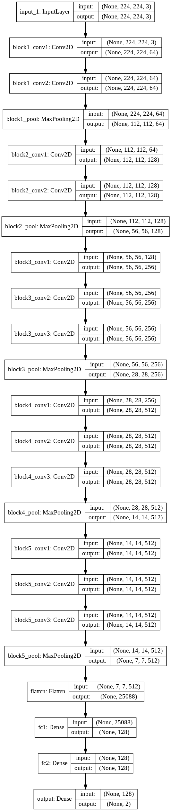

The output layer of the Transfer Learning implementation is the same as in the custom implementation, again leading to a 2 categorical output representing 'PD is present' and 'PD is absent'.

#### Common Training implementation and settings

For all neural networks I am using the SGD optimizer with a learning rate of 0.005. I am using 'categorical_crossentropy' as the loss function in all implementation.

During the training I am using the ModelCheckpoint and EarlyStopping callbacks. I checkpoint the weights of the last epoch that lead to a reduction of the loss (ModelCheckpoint) to disk, and I stop the training after 15 epochs that did not lead to any improvement of the loss.

Before evaluating the trained model with Accuracy, Precision, Recall, F1-Score and MCC functions I load the latest best checkpoint.

### Refinement

#### PCA + Dense Network implementation

The 3 layers with their sizes 2048, 1024 and 512 where used from the beginning on and seem to be a good sizing. I initially did not use Batch Normalization, after starting to use it between the Dense layer and the Relu activation I saw some good improvement the the validation results. 

I initially started with a dropout rate of 0.5 between the layers. Reducing it to 0.35 improved the results slightly. I also experimented with the use of Dropouts and the results where better with it.

#### PCA + 1D CNN implementation

I initially used Dropouts in the 1D CNN too. However I saw better results when not using Dropouts at all. I less nodes to begin with when training the models on a CPU, after moving to Google colab and having GPU support I achieved better results with using more nodes.

#### Spectogram pictures + 2D CNN implementation

The model I initially choose performed pretty well from the beginning on. I added more nodes after having access to GPUs, else I kept it pretty constant over the course of the project.

#### Spectogram pictures + 2D CNN Transfer learning VGG16 implementation

I tested several pre-trained networks, always exchanging the final categorical layers with the two 128 node dense layers I described earlier. I tested ResNet50, ResNeXt50, VGG16, VGG19 and InceptionV3. I had the best results using VGG16 and choose it as my final model.

## IV. Results
_(approx. 2-3 pages)_

### Model Evaluation and Validation
In this section, the final model and any supporting qualities should be evaluated in detail. It should be clear how the final model was derived and why this model was chosen. In addition, some type of analysis should be used to validate the robustness of this model and its solution, such as manipulating the input data or environment to see how the model’s solution is affected (this is called sensitivity analysis). Questions to ask yourself when writing this section:
- _Is the final model reasonable and aligning with solution expectations? Are the final parameters of the model appropriate?_
- _Has the final model been tested with various inputs to evaluate whether the model generalizes well to unseen data?_
- _Is the model robust enough for the problem? Do small perturbations (changes) in training data or the input space greatly affect the results?_
- _Can results found from the model be trusted?_

### Justification
In this section, your model’s final solution and its results should be compared to the benchmark you established earlier in the project using some type of statistical analysis. You should also justify whether these results and the solution are significant enough to have solved the problem posed in the project. Questions to ask yourself when writing this section:
- _Are the final results found stronger than the benchmark result reported earlier?_
- _Have you thoroughly analyzed and discussed the final solution?_
- _Is the final solution significant enough to have solved the problem?_

## V. Conclusion
_(approx. 1-2 pages)_

### Free-Form Visualization
In this section, you will need to provide some form of visualization that emphasizes an important quality about the project. It is much more free-form, but should reasonably support a significant result or characteristic about the problem that you want to discuss. Questions to ask yourself when writing this section:
- _Have you visualized a relevant or important quality about the problem, dataset, input data, or results?_
- _Is the visualization thoroughly analyzed and discussed?_
- _If a plot is provided, are the axes, title, and datum clearly defined?_

### Reflection
In this section, you will summarize the entire end-to-end problem solution and discuss one or two particular aspects of the project you found interesting or difficult. You are expected to reflect on the project as a whole to show that you have a firm understanding of the entire process employed in your work. Questions to ask yourself when writing this section:
- _Have you thoroughly summarized the entire process you used for this project?_
- _Were there any interesting aspects of the project?_
- _Were there any difficult aspects of the project?_
- _Does the final model and solution fit your expectations for the problem, and should it be used in a general setting to solve these types of problems?_

### Improvement
In this section, you will need to provide discussion as to how one aspect of the implementation you designed could be improved. As an example, consider ways your implementation can be made more general, and what would need to be modified. You do not need to make this improvement, but the potential solutions resulting from these changes are considered and compared/contrasted to your current solution. Questions to ask yourself when writing this section:
- _Are there further improvements that could be made on the algorithms or techniques you used in this project?_
- _Were there algorithms or techniques you researched that you did not know how to implement, but would consider using if you knew how?_
- _If you used your final solution as the new benchmark, do you think an even better solution exists?_

Talk about SMOTE for oversampling here
Talk about using Wavelets instead of NFFT

-----------

### Links to resources and papers

[[1] Technical University of Ostrava academic paper: https://ieeexplore.ieee.org/document/7909221](https://ieeexplore.ieee.org/document/7909221)

[[1] Technical University of Ostrava academic paper - Dropbox Link: https://www.dropbox.com/s/2ltuvpw1b1ms2uu/A%20Complex%20Classification%20Approach%20of%20Partial%20Discharges%20from%20Covered%20Conductors%20in%20Real%20Environment%20%28preprint%29.pdf?dl=0](https://www.dropbox.com/s/2ltuvpw1b1ms2uu/A%20Complex%20Classification%20Approach%20of%20Partial%20Discharges%20from%20Covered%20Conductors%20in%20Real%20Environment%20%28preprint%29.pdf?dl=0)

[[2] Wikipedia entry for Partial Discharge (PD): https://en.wikipedia.org/wiki/Partial_discharge](https://en.wikipedia.org/wiki/Partial_discharge)

[[3] Kaggle vsb-power-line-fault-detection data: https://www.kaggle.com/c/vsb-power-line-fault-detection/data](https://www.kaggle.com/c/vsb-power-line-fault-detection/data)

[[4] Matplolib specgram function: https://matplotlib.org/3.1.1/api/_as_gen/matplotlib.pyplot.specgram.html](https://matplotlib.org/3.1.1/api/_as_gen/matplotlib.pyplot.specgram.html)

[[5] Fast Fourier Transform Wikipedia entry: https://en.wikipedia.org/wiki/Fast_Fourier_transform](https://en.wikipedia.org/wiki/Fast_Fourier_transform)

[[6] Butterworth Filter Wikipedia entry: https://en.wikipedia.org/wiki/Butterworth_filter](https://en.wikipedia.org/wiki/Butterworth_filter)

[[7] Using pywavelet to remove high frequency noise: http://connor-johnson.com/2016/01/24/using-pywavelets-to-remove-high-frequency-noise/](http://connor-johnson.com/2016/01/24/using-pywavelets-to-remove-high-frequency-noise/)

[[8] Kaggle vsb-power-line-fault-detection leader-board: https://www.kaggle.com/c/vsb-power-line-fault-detection/leaderboard](https://www.kaggle.com/c/vsb-power-line-fault-detection/leaderboard)

[[9] Article on the location of PD patterns: http://www.hitequest.com/Kiss/hv_isolation.htm](http://www.hitequest.com/Kiss/hv_isolation.htm)

[[10] Google colab: https://colab.research.google.com](https://colab.research.google.com)

**Before submitting, ask yourself. . .**

- Does the project report you’ve written follow a well-organized structure similar to that of the project template?
- Is each section (particularly **Analysis** and **Methodology**) written in a clear, concise and specific fashion? Are there any ambiguous terms or phrases that need clarification?
- Would the intended audience of your project be able to understand your analysis, methods, and results?
- Have you properly proof-read your project report to assure there are minimal grammatical and spelling mistakes?
- Are all the resources used for this project correctly cited and referenced?
- Is the code that implements your solution easily readable and properly commented?
- Does the code execute without error and produce results similar to those reported?